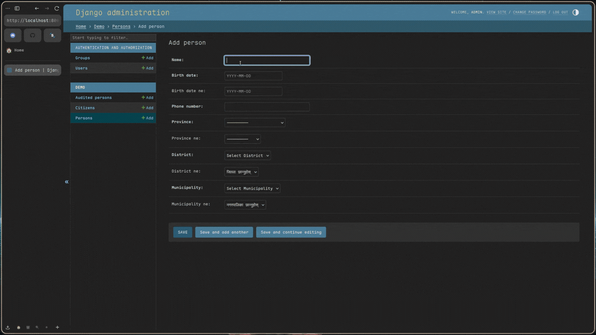

# 🇳🇵 django-nepkit

<div align="center">

[](https://badge.fury.io/py/django-nepkit)
[](https://pypi.org/project/django-nepkit/)
[](https://www.djangoproject.com/)
[](https://opensource.org/licenses/MIT)

**A toolkit for handling BS dates, regional locations, and validation in the local context.**

</div>

Building software for local requirements comes with unique challenges, from handling BS dates to managing the regional administrative hierarchy. `django-nepkit` provides solutions for these requirements directly within the Django ecosystem.



---

## 🎯 Features

- **📅 BS Date & Time Support**: Model fields for `nepalidate`, `nepalidatetime` and `time` objects, with optional Devanagari digit output.
- **🗺️ Regional Locations**: Pre-defined Provinces, Districts, and Municipalities.
- **📱 Phone Validation**: Patterns for local mobile and landline numbers.
- **💰 Currency Formatting**: `NepaliCurrencyField` with automatic Lakhs/Crores comma placement.
- **🔤 Numbers to Words**: Convert digits into Nepali text representation.
- **🔌 Admin Integration**: Automatic setup for datepickers and localized list displays.
- **🚀 Framework-agnostic API helpers**: Pure-Python serialize/deserialize functions that work with any framework (DRF, Ninja, plain Django, …) — **no third-party API dependency**.
- **⚡ Location Chaining**: Address linking via client side JS or server driven HTMX.
- **🔍 Address Normalization**: Utility to extract structured locations from raw strings.

---

## 🛠 Setup

Installation:

```bash
pip install django-nepkit
```

### 1. Basic Configuration

Add it to your `INSTALLED_APPS`:

```python
INSTALLED_APPS = [
    # ...
    "django_nepkit",
]
```

### 2. Global Control

Configure behavior in your `settings.py`:

```python
NEPKIT = {
    "DEFAULT_LANGUAGE": "en",           # "en" or "ne"
    "ADMIN_DATEPICKER": True,           # Toggle the datepicker
    "TIME_FORMAT": 12,                  # 12 or 24 hour display
    "BS_DATE_FORMAT": "%Y-%m-%d",       # Default storage / display format
    "BS_DATETIME_FORMAT": "%Y-%m-%d %H:%M:%S",
    "BS_TIME_FORMAT": "%I:%M %p",       # 12-hour by default
    "DATE_INPUT_FORMATS": ["%Y-%m-%d", "%d/%m/%Y", "%d-%m-%Y"],
    "TIME_INPUT_FORMATS": ["%H:%M:%S", "%H:%M", "%I:%M %p", "%I:%M:%S %p"],
}
```

> Settings are read from `settings.NEPKIT` on every access, so
> `override_settings(NEPKIT={…})` (e.g. in tests) works as expected. If
> you need to flip `DEFAULT_LANGUAGE` at runtime, call
> `field.refresh_choices()` on any `ProvinceField` / `DistrictField` /
> `MunicipalityField` that has already been instantiated.

---

## 🚀 Core Usage

### 1. Model Implementation

Fields store `YYYY-MM-DD` strings for database stability while providing BS objects in Python.

```python
from django_nepkit import NepaliDateField, NepaliPhoneNumberField

class Profile(models.Model):
    name = models.CharField(max_length=100)
    birth_date = NepaliDateField() # BS Date support
    phone = NepaliPhoneNumberField() # Local pattern validation
```

### 2. Admin Integration

Use `NepaliModelAdmin` for automatic formatting and datepicker support.

```python
from django_nepkit import NepaliModelAdmin, NepaliDateFilter

@admin.register(Profile)
class ProfileAdmin(NepaliModelAdmin):
    list_display = ("name", "birth_date", "phone")
    list_filter = (("birth_date", NepaliDateFilter),)
```

---

## 🗺️ Address Management

Manage the **Province → District → Municipality** hierarchy.

### Client-Side Chaining (Standard)

Cascading selects in the Django Admin without extra configuration.

```python
from django_nepkit import ProvinceField, DistrictField, MunicipalityField

class Address(models.Model):
    province = ProvinceField()
    district = DistrictField()
    municipality = MunicipalityField()
```

### Address Normalization

Standardize raw strings into structured location data (Province, District, Municipality).

```python
from django_nepkit.utils import normalize_address

# Supports English or Nepali input
result = normalize_address("House 123, Bharatpur, Chitwan")
# Returns: {'province': 'Bagmati Province', 'district': 'Chitawan', 'municipality': 'Bharatpur Metropolitan City'}

result_ne = normalize_address("विराटनगर, कोशी")
# Returns: {'province': 'कोशी प्रदेश', 'district': 'मोरङ', 'municipality': 'विराटनगर महानगरपालिका'}
```

### Server Side Chaining (HTMX)

Enable `htmx=True` for a server driven experience.

> [!IMPORTANT]
> **HTMX Setup:**
> Include the required URLs in your main `urls.py`:
>
> ```python
> path("nepkit/", include("django_nepkit.urls")),
> ```

---

## 🔌 API Integration (framework-agnostic)

`django-nepkit` ships pure-Python helpers in `django_nepkit.api` so you can
emit JSON from **any** view layer — plain Django, DRF, Django Ninja, or
something custom. There is no dependency on a third-party API package.

```python
from django.http import JsonResponse
from django_nepkit import api as nepkit_api

def person_payload(person, *, ne: bool = False) -> dict:
    return nepkit_api.build_localized_payload(
        {
            "id": person.id,
            "name": person.name,
            "birth_date": nepkit_api.serialize_nepali_date(person.birth_date, ne=ne),
            "amount": nepkit_api.serialize_nepali_currency(person.amount, ne=ne),
        },
        ne=ne,                              # also emits *_ne mirrors when ne=True
    )
```

Available helpers:

| helper | purpose |
| ------ | ------- |
| `serialize_nepali_date` / `deserialize_nepali_date` | BS date strings ↔ `nepalidate` |
| `serialize_nepali_datetime` / `deserialize_nepali_datetime` | BS datetime ↔ `nepalida­tetime` |
| `serialize_nepali_time` / `deserialize_nepali_time` | HH:MM / hh:mm AM/PM ↔ `time` |
| `serialize_nepali_currency` / `deserialize_nepali_currency` | `"Rs. 12,34,567.00"` / Devanagari digits ↔ `Decimal` |
| `to_decimal` | coerce strings / numbers to `Decimal` |
| `build_localized_payload` | add `*_ne` mirrors to a dict representation |

All `serialize_*` / `deserialize_*` helpers (and `to_decimal`) accept a
`strict: bool = False` argument.  When `strict=True`, unparseable input
raises `ValueError` instead of being silently returned as `str(value)`,
which makes it easy to layer strict validation into API endpoints that
need to surface 400s on bad input:

```python
try:
    cleaned = nepkit_api.deserialize_nepali_date(request.data["dob"], strict=True)
except ValueError as exc:
    return JsonResponse({"error": str(exc)}, status=400)
```

The previous `django_nepkit.serializers` (DRF) and `django_nepkit.ninja`
modules were removed in v0.2.2 because they made the package drag in
extra dependencies. If you need a thin DRF/Ninja adapter it is now a
ten-line file that delegates to `django_nepkit.api`.

---

## 💰 Formatting & Helpers

### 1. Currency & Numbers
Use `NepaliCurrencyField` for automatic formatting in the admin and templates.

```python
from django_nepkit import NepaliCurrencyField

class Transaction(models.Model):
    amount = NepaliCurrencyField() # Defaults to 19 digits, 2 decimals
```

### 2. Template Filters
Load the tags to use localized formatting in your templates.

```html


<!-- Comma formatting: Rs. 1,12,000.00 -->
<p>{{ 112000 | nepali_currency }}</p>

<!-- Numbers to Words: एक सय तेईस -->
<p>{{ 123 | nepali_words }}</p>

<!-- English to Nepali Digits: १२३ -->
<p>{{ "123" | nepali_unicode }}</p>
```

---

## 🕒 Technical Design

This library is engineered for performance, data integrity, and local compliance.

### 1. The "Source of Truth" Strategy
We avoid on-the-fly `AD to BS` conversion during database queries because it is computationally expensive and prone to logical drift (due to lunar calendar offsets).
- **Storage**: All BS dates are stored as `VARCHAR(10)` in `YYYY-MM-DD` format.
- **Sorting**: Because `YYYY` is at the start, string based database sorting (ascending/descending) accurately matches chronological order.
- **Indexability**: Standard B-Tree indexes work perfectly on these fields without requiring custom database functions.
- **Timezone Safety**: Dates are stored without time components, making them immune to server side timezone shifts during saving.

### 2. Python Object Mapping
While data is stored as strings, it is automatically hydrated into rich Python objects.
- **`nepali-datetime` Integration**: Values are cast to `nepalidate` or `nepalidatetime` objects when retrieved from the database.
- **Validation**: Fields use specialized validators (e.g., `validate_nepali_phone_number`) that leverage official regional patterns.

### 3. Frontend Architecture
- **Automatic Initialization**: The library includes a lightweight JS observer that automatically initializes the datepicker for any field with the `.nepkit-datepicker` class.
- **Theme Support**: The datepicker dynamically adapts its skin based on the Django Admin's dark/light mode state.

---

## ❓ FAQ

**Q: How do I handle Null or Optional dates?**

Just like standard Django fields, pass `null=True, blank=True` to any `django-nepkit` field. The library handles empty strings and `None` values gracefully.

**Q: Can I change the database storage format?**

No. The `YYYY-MM-DD` format is hardcoded to ensure database level sorting and indexing work consistently. However, you can change the **display** format via global settings or template filters.

**Q: Can I use Devanagari output?**

Yes. Pass `ne=True` to fields, widgets, or use the `serialize_*` helpers
in `django_nepkit.api` to emit Devanagari digits from any view.

**Q: Can I display the datepicker in English?**

Yes. By default, if you pass `en=True` (or if `DEFAULT_LANGUAGE` is set to `"en"`), the datepicker will display month and day names in English instead of Devanagari script.

```python
birth_date = NepaliDateField(en=True)  # English month/day names in picker
```

**Q: Is the location data up to date?**

Yes. Province, District, and Municipality data is sourced from the `nepali` Python package, which is regularly updated to reflect administrative changes in Nepal.

**Q: Does it work with standard Django Forms?**

Yes. `NepaliDateField` uses a specialized `NepaliDateFormField` that automatically handles input parsing and error reporting.

**Q: How do I migrate existing English (AD) dates to BS?**

We recommend staying on standard `DateField` for AD data. If you must convert to BS, use our [Migration Script](docs/migration_guide.py) to perform a bulk data transformation safely.

**Q: Why use VARCHAR instead of a native DateField?**

Native `DateField` in most SQL engines is locked to the Gregorian calendar. Using `VARCHAR` allows us to treat the BS date as the primary data point, avoiding the "off-by-one" conversion errors common when syncing two disparate calendars.

---

## 🤝 Community

We welcome contributions and feedback from the community.

1. **Clone**: `git clone https://github.com/S4NKALP/django-nepkit`
2. **Setup**: `uv sync`
3. **Test**: `uv run pytest`

---

## 🙏 Credits

This library is built on top of excellent open source projects:

- **[nepali](https://github.com/opensource-nepal/py-nepali)** by [@opensource-nepal](https://github.com/opensource-nepal) - Provides the core `nepalidate`, `nepalidatetime` objects and regional location data (Provinces, Districts, Municipalities).
- **[Nepali Datepicker](https://nepalidatepicker.sajanmaharjan.com.np/)** by [Sajan Maharjan](https://github.com/sajanm/nepali-date-picker) - Powers the beautiful BS date picker widget in the Django Admin.

---

MIT License. Designed for the local Django ecosystem.
